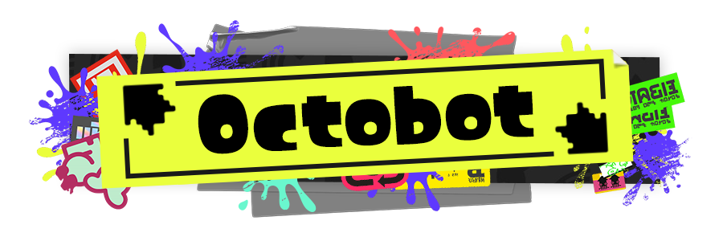

    

<a href="https://github.com/TeamOctolings/Octobot/blob/master/LICENSE"></img></a>
<a href="https://github.com/Remora/Remora.Discord"></img></a>
<a href="https://github.com/TeamOctolings/Octobot/commit/master"></img></a>

Veemo! I'm a general-purpose bot for moderation (formerly known as Boyfriend) written by [Team Octolings](https://github.com/TeamOctolings) in C# and Remora.Discord

## Features

* Banning, muting, kicking, etc.
* Reminding you about something if you wish
* Reminding everyone about that new event you made
* Renaming those annoying self-hoisting members
* Log everything from joining the server to deleting messages
* Listen to Inkantation!

*...a-a-and more!*

## Building Octobot

Check out the Octobot's Wiki for details.

| [Windows](https://github.com/TeamOctolings/Octobot/wiki/Installing-Windows) | [Linux/macOS](https://github.com/TeamOctolings/Octobot/wiki/Installing-Unix) |
| --- | --- |

## Contributing

When it comes to contributing to the project, the two main things you can do to help out are reporting issues and
submitting pull requests. Please refer to the [contributing guidelines](CONTRIBUTING.md) to understand how to help in
the most effective way possible.

#
Not an official Splatoon™ product. We are in no way affiliated with or endorsed by Nintendo Company, or other rightsholders.
